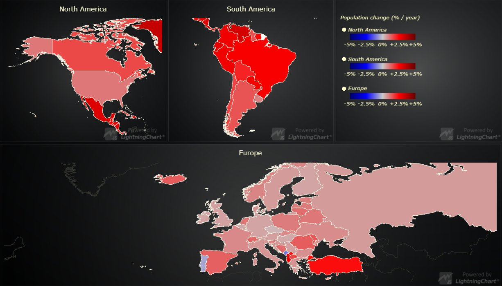

# JavaScript Real-time Map Dashboard



This demo application belongs to the set of examples for LightningChart JS, data visualization library for JavaScript.

LightningChart JS is entirely GPU accelerated and performance optimized charting library for presenting massive amounts of data. It offers an easy way of creating sophisticated and interactive charts and adding them to your website or web application.

The demo can be used as an example or a seed project. Local execution requires the following steps:

- Make sure that relevant version of [Node.js](https://nodejs.org/en/download/) is installed
- Open the project folder in a terminal:

        npm install              # fetches dependencies
        npm start                # builds an application and starts the development server

- The application is available at *http://localhost:8080* in your browser, webpack-dev-server provides hot reload functionality.


## Description

Example on using `MapChart` with real-time animated data set and dynamic region coloring.

The data set is downloaded with `fetch` when the application is started.
It contains population for each country in Europe, North and South America in the year range between 1961-2019.

The dashboard contains 3 charts (for each region) and 1 cell with UI panel.
The UI panel contains interactive slider that can set a data period and year marker that can pause and start animation.

Every time the active year is changed, map regions data is quickly invalidated in real-time with the 'invalidateRegionValues' method

```js
// Code snippet setting region values for all 3 map charts.
let year = 2005;

const regionValuesData = populationData.map((item) => ({
  ISO_A3: item["Country Code"],
  value: item[year],
}));

chartEurope.invalidateRegionValues(regionValuesData);
chartSA.invalidateRegionValues(regionValuesData);
chartNA.invalidateRegionValues(regionValuesData);
```


## API Links

* [Dashboard]
* [Map chart]
* [Map types]
* [Color look up table]
* [Paletted fill style]
* [Color factory RGBA]
* [UI element builders]
* [UI layout builders]
* [Legend box builders]


## Support

If you notice an error in the example code, please open an issue on [GitHub][0] repository of the entire example.

Official [API documentation][1] can be found on [Arction][2] website.

If the docs and other materials do not solve your problem as well as implementation help is needed, ask on [StackOverflow][3] (tagged lightningchart).

If you think you found a bug in the LightningChart JavaScript library, please contact support@arction.com.

Direct developer email support can be purchased through a [Support Plan][4] or by contacting sales@arction.com.

[0]: https://github.com/Arction/
[1]: https://www.arction.com/lightningchart-js-api-documentation/
[2]: https://www.arction.com
[3]: https://stackoverflow.com/questions/tagged/lightningchart
[4]: https://www.arction.com/support-services/

© Arction Ltd 2009-2020. All rights reserved.


[Dashboard]: https://www.arction.com/lightningchart-js-api-documentation/v3.1.0/classes/dashboard.html
[Map chart]: https://www.arction.com/lightningchart-js-api-documentation/v3.1.0/classes/mapchart.html
[Map types]: https://www.arction.com/lightningchart-js-api-documentation/v3.1.0/globals.html#maptypes
[Color look up table]: https://www.arction.com/lightningchart-js-api-documentation/v3.1.0/classes/lut.html
[Paletted fill style]: https://www.arction.com/lightningchart-js-api-documentation/v3.1.0/classes/palettedfill.html
[Color factory RGBA]: https://www.arction.com/lightningchart-js-api-documentation/v3.1.0/globals.html#colorrgba
[UI element builders]: https://www.arction.com/lightningchart-js-api-documentation/v3.1.0/globals.html#uielementbuilders
[UI layout builders]: https://www.arction.com/lightningchart-js-api-documentation/v3.1.0/globals.html#uilayoutbuilders
[Legend box builders]: https://www.arction.com/lightningchart-js-api-documentation/v3.1.0/globals.html#legendboxbuilders

